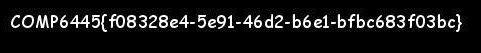
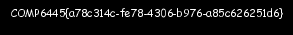
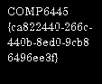

# 6445 - CTF1 - Andrew Bennett

## LEVEL 0
__FLAG: `COMP6445{60c2f244-fb35-49c1-86a2-2c6e334bd74b}`__

```console
andrew@niko:~/forensics/exam/easyflags/level0$ cat flag0.txt | base64 -d
COMP6445{60c2f244-fb35-49c1-86a2-2c6e334bd74b}
```

## LEVEL 1
__FLAG: `COMP6445{201cdbd5-135b-4a77-8eba-58793f6622e3}`__

```console
andrew@niko:~/forensics/exam/easyflags/level1$ for x in */*; do cat $x | base64 -d; done | grep "COMP"
COMP6445{201cdbd5-135b-4a77-8eba-58793f6622e3}
```
## LEVEL 2
```console
andrew@niko:~/forensics/exam/easyflags/level2$ cp guess.what file.zip && unzip -P password file.zip
Archive:  file.zip
  inflating: flag2.jpg  

```
```console
andrew@niko:~/forensics/exam/easyflags/level2$ eog flag2.jpg
```


## LEVEL 3
__FLAG: `COMP6445{9ffd73a4-7653-4bd0-a0ec-cd28784a368f}`__

```console
andrew@niko:~/forensics/exam/easyflags/level3$ strings words.pdf | tail -1
COMP6445{9ffd73a4-7653-4bd0-a0ec-cd28784a368f}
```

## LEVEL 4
__FLAG: `COMP6445{9494afcc-0355-45e1-815a-60e00e340eb7}`__

```console
andrew@niko:~/forensics/exam/trickyflags/level4$ cat solve4.py 
```
```python
import sys
a = open("img-DOSctf.img", "rb").read()[0x10e:0x12a]
for x in a:
    if ord(x) in [0x2d, 0x7b, 0x7d, 0x43, 0x4f, 0x4d, 0x50]:
        sys.stdout.write(x)
    else:
        sys.stdout.write("%02x" % ord(x))
```
```console
andrew@niko:~/forensics/exam/trickyflags/level4$ python solve4.py 
COMP6445{9494afcc-0355-45e1-815a-60e00e340eb7}
```


## LEVEL 5
__FLAG: `COMP6445{f6f3a550-f5a8-4bf5-aa29-2ebe0fa0c28c}`__

```console
andrew@niko:~/forensics/exam/trickyflags/level5$ ./xor-files a b
COMP6445{f6f3a550-f5a8-4bf5-aa29-2ebe0fa0c28c}
```

## LEVEL 6
__FLAG: `COMP6445{2cb45f93-fdd7-431b-97f2-3a5474f59cf4}`__

```console
andrew@niko:~/forensics/exam/trickyflags/level6$ cat solve6.py 
```
```python
import sys
y = open("lvl6.ddimg", "rb").read()
for x in range(0xa000, 0x21000, 0x800):
    sys.stdout.write(y[x])
```
```console
andrew@niko:~/forensics/exam/trickyflags/level6$ python solve6.py 
COMP6445{2cb45f93-fdd7-431b-97f2-3a5474f59cf4}
```


## LEVEL 7
```console
andrew@niko:~/forensics/exam/trickyflags/level7/HPA$ binwalk --offset=536000000 --dd="png" HPA.img
DECIMAL       HEXADECIMAL     DESCRIPTION
--------------------------------------------------------------------------------
536832512     0x1FFF6A00      PNG image, 300 x 25, 4-bit colormap, non-interlaced

```
```console
andrew@niko:~/forensics/exam/trickyflags/level7/HPA$ eog _HPA.img_extracted/1FFF6A00
```


## LEVEL 8
__FLAG: `COMP6445{0ebc14ca-6b04-41ea-87e6-1f9ed5cf}`__

```console
andrew@niko:~/forensics/exam/trickyflags/level8$ cat decode.py 
```
```python
import sys
print sys.stdin.read().replace("H\n","").decode("hex")
```
```console
andrew@niko:~/forensics/exam/trickyflags/level8$ strings lvl8 | grep "H$" | python decode.py 
COMP6445{0ebc14ca-6b04-41ea-87e6-1f9ed5cf}
```

## LEVEL 9
```console
andrew@niko:~/forensics/exam/trickyflags/level9$ diff --changed-group-format='%>' --unchanged-group-format=''   -a knight pawn | tr -d "\n" | grep -a -o "Q[^=]*==" | head -1 | base64 -d
COMP6445{c2383817-e674-4797-b236-37ef96ed1e19}
```

## LEVEL 10

```console
andrew@niko:~/forensics/exam/trickyflags/level10/images$ ls -lasht |
head -4
total 267M
4.0K drwxrwxr-x 5 andrew andrew  4.0K Sep 19 19:02 ..
 20K drwxr-xr-x 2 andrew andrew   20K Sep 19 16:09 .
884K -rw-r--r-- 1 andrew andrew  874K Sep 15 20:27
24648aad857a59ba3da9732c493e4715df732ef7
```
```console
andrew@niko:~/forensics/exam/trickyflags/level10/images$ file
24648aad857a59ba3da9732c493e4715df732ef7 
24648aad857a59ba3da9732c493e4715df732ef7: GIF image data, version 89a,
245 x 132
```
```console
andrew@niko:~/forensics/exam/trickyflags/level10/images$ convert
-coalesce 24648aad857a59ba3da9732c493e4715df732ef7[29] flag.pgm
```
```console
andrew@niko:~/forensics/exam/trickyflags/level10/images$ eog flag.pgm
```


## LEVEL 11
__FLAG: `COMP6445{989b0f3e-fd04-413b-b08e-865c4a2fd11d}`__

```console
andrew@niko:~/forensics/exam/trickyflags/level11$ python -c "print '54686570617373776F72646973627572676572212121'.decode('hex')"
Thepasswordisburger!!!
```
```console
andrew@niko:~/forensics/exam/trickyflags/level11$ steghide extract -sf 54686570617373776F72646973627572676572212121.jpg -p burger
wrote extracted data to "flag.txt".
```
```console
andrew@niko:~/forensics/exam/trickyflags/level11$ cat flag.txt 
Nice work! Sorry for the trolls :P
Good luck with the rest of the CTF :)

COMP6445{989b0f3e-fd04-413b-b08e-865c4a2fd11d}
```


